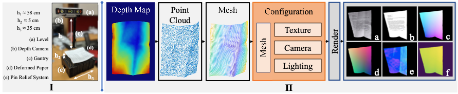
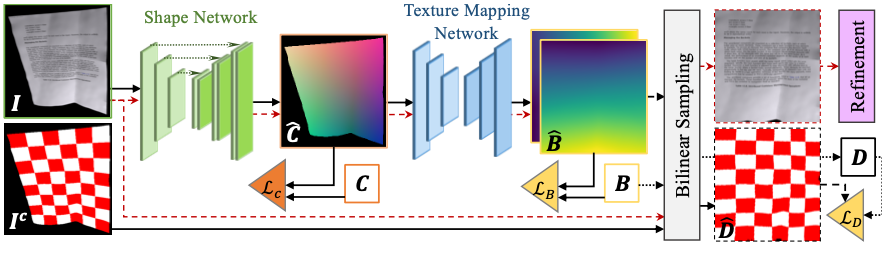
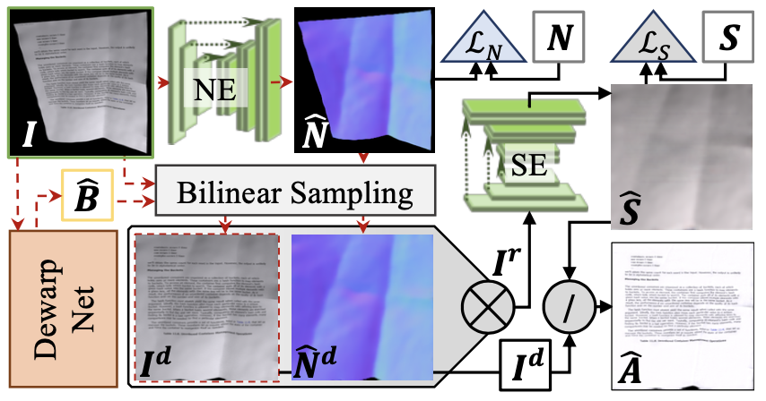

# DewarpNet Review

## DewarpNet Overview
- 모바일로부터 촬영된 문서 이미지의 경우 왜곡이 많이 발생하는데 warping(구겨진)된 이미지를 Unwarping 하여  flat하게 만들어주는 'Un-warping' framework 이다.
- Un warping 방법으로는 이미지를 flat하게 변형하여 3D shape을 예측한 후 flat 하게 변형한다.
  - document warping(document folding)의 경우 3D에서 발생한것이기 때문에 3D shape을 예측하는 것이 매우 중요
- DewarpNet은 두 개의 sub-network로 구성되어 있음
  - Shape Network : warping 된 문서(deformed document)를 입력으로 하먀며 3차원 좌표계 map을 출력
  - Texture Network : warping 된 문서 이미지를 flat한 문서 이미지로 backward map() 한다.
    - backward mapping : 결과 영상의 모든 각 픽셀이 해당 원본 영상의 어느 픽셀의 위치에서 매핑이 되었는지 판단하는 방식 (즉, 결과이미지 에서 입력 이미지를 추론하는 것)

  

## 1) Dataset

 Data 수집 pipeline

- 실제 document image와 rendering software(Blender) 하이브리드 방식으로 Doc3D 데이터 셋 생성 
  - Blender : 3D modeling package
- GT 데이터 생성 과정은 자연적으로 변형된 실제 document(이미지가 아님)의 3D shape 획득 후 Blender에서 path tracing을 사용해 실제 document texture를 렌더링 하는 방법으로 데이터 셋 생성
- 간단하게 요약하면, 변형된 실제 이미지를 3D 카메라로 촬영하여 데이터 셋을 확보한 것이며 dataset의 다양헝을 증가시키기 위해 camera, 조명, texture (rendering process)fmf 변형하여 데이터를 생성한 것이며 아래와 같은 정보를 획득 할 수있다. 
  - albedo map (위 그림 중 b에 해당)
  - UV maps(texture maps) (c)
  - 3D coordinate maps (d)
  - Surface normals (e)
  - depth map (f)

 

## 2) Network Architecture

 DewarpNet Frmaework

- 위 그림처럼 DewarpNet은 두 개의 sub-network(Shape Network, Texture Mapping Network)로 구성되어 있으며 추가적으로, un-warped 된(최종 결과이미지) 이미지의 시각적 개선을 위한 후처리 모듈인 refinement module을 포함한다. 
  - 즉, I(입력이미지)를 입력받아 Shape Network를 통해 C(3D coordinate map)으로 변환한 후 Texture Mapping Network를 통해 C를 B(Texture coordinate map)으로 변환한다. 최종적으로 refinement network를 통해  B로부터 D(Unwarped Document image)를 생성한다.
 

 

### 2-1) Shape Network
- Shape Network는 입력 이미지에 대해 각각의 픽셀을 변환하여 3D coordinate map으로 변경한다. 
  - Coordinamte map : 각 픽셀을 (x,y,3) -> (x,y,z) 3차원으로 변경
- Shape Network는 3차원 Coordinate map을 구하는 과정을 Image-to-Image Translation 방법으로 해결하였으며 U-Net 구조의 encoder-decoder 구조로 network를 구성하였다.

 

### 2-2) Texture Mapping Network
- Texture Mapping Network는 Shape Network로 부터 생성된 Coordinate map을 입력으로 하여 'backward mapping'을 output 결과로 출력한다.
- Texture Mapping Network에서 coordinate map을 texture coordinate로 변환하기 위해 multiple DenseNet block을 이용한 encoder-decoder 구조를 사용하였으며 Coordinate Convolution (CoordConv)를 적용하였다.
  - texture coordinate (UV Coordinate) : texture image를 3차원 공간의 폴리곤에 입히기 위해 변환 기준이 되는 2차원 좌표계
  - CoordConv를 적용하면 일반화 성능이 향상 된다고 한다.

 

### 2-3) Refinement Network

 Refinement Network 구조

- Refinement Network는 변형된 이미지(unwarped image)에 대한 'illumination effect'를 조절하기 위한 후처리 방법이다. 
  - 논문에 따르면 이를통해 인지능력 향상(perceptual quality)과 OCR 성능을 향상 시킬 수 있었다고 한다.
  - surface map과 aldebo map을 GT로 하여 Refinement Network를 학습
- Refinement Network는 U-Net 구조의 encoder-decoder로 구성되어 있있다.
  - U-Net 1: Surface normal 예측
  - U-Net 2: surface normal을 통해 shading map 예측 (shading map은 shading intensity와 color를 표현)

  

## 3) Training Loss  Functions
- DewarpNet은 두 단계로 모델이 학습 된다.
  - Phase 1 : 최기화를 위해 Shape Network와 Texture Mapping Network는 각각 독립적으로 학습한다.
  - Phase 2 : 이후, unwarping image의 결과를 향상시키기 위해 두 개의 sub-network(shape network, texture mapping network)를 결합하여 학습힌다.
- 구체적인 수식은 논문 참고

 

## 4) Result
- 공개된 오픈소스 테스트 결과 스캔된 document image에 적용한 경우 오히려 왜곡이 심해짐
  