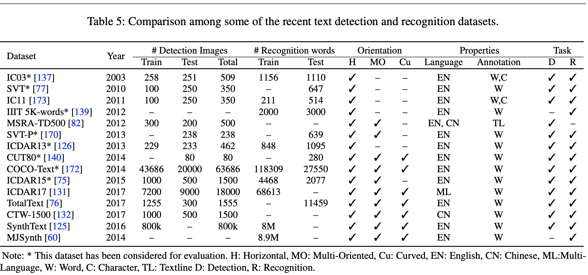
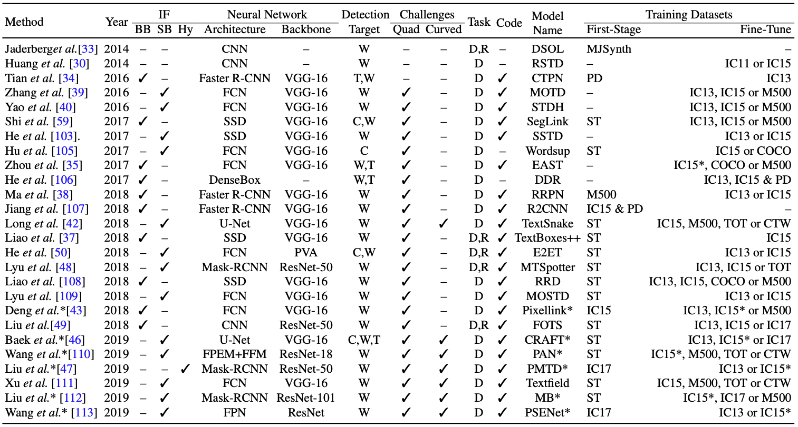
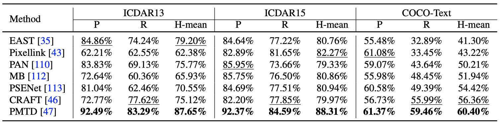
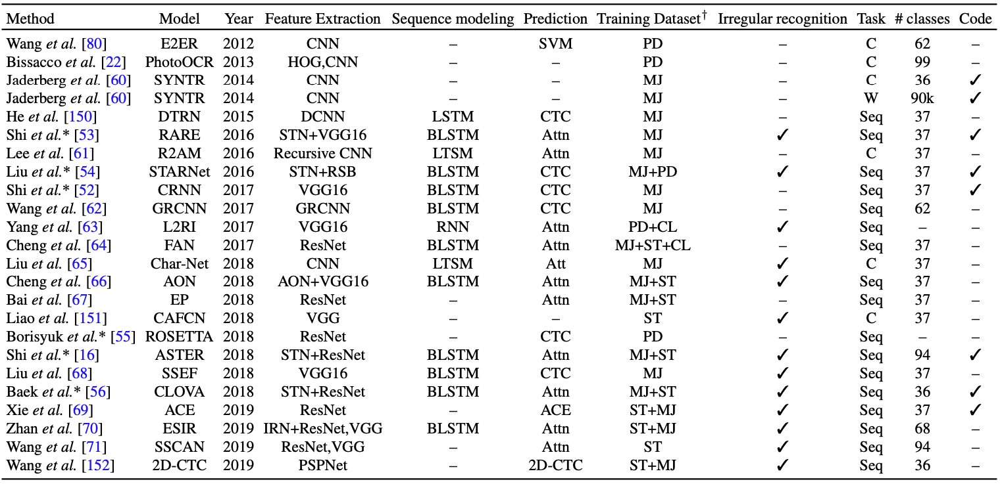
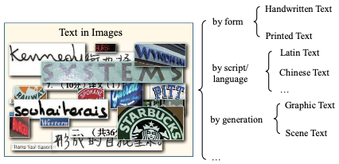
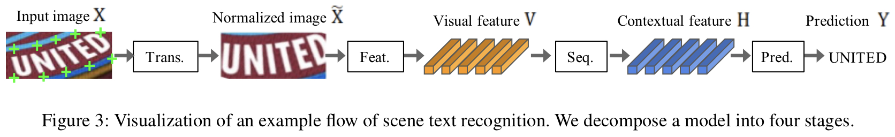
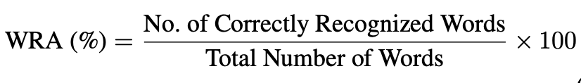

# OCR Survey Paper Review

(Review Papers)
- Text Detection and Recognition in the Wild-A Review
- Text Recognition in the Wild-A Survey
- What Is Wrong With Scene Text Recognition Model Comparisons? Dataset and Model Analysis

  

## Dataset

 Dataset 종류

- **MJSynth** : text recognition을 위해 합성으로 만들어진 데이터 셋
- **SynthText** : 종합적인 wild scene text 이미지로 구성된 데이터 셋
- **ICDAR03** : 수평의 카메라로 촬영된 Scene Text Image 
- **ICDAR13** : 수평의 Scene text image, 데이터셋의 quality가 좋고 텍스트의 영역이 보통 이미지에 가운데에 위치해 있다.
- **ICDAR15** : Text가 word-level로 다양한 방향으로 위치해 있고, 여러 조명 및 background condition에서 획득 되었다.
- **COCO-Text** : 가장 크고 challenging text 데이터 셋 
- **SVT** : Street View Text dataset으로  google street view를 통해 획득 되었다.
- **SVT-P** : SVT - Perspective dataset으로 perspective distorted scene text 데이터를 평가하기 위한 목적으로 만들어 짐
- **IIIT 5K-words** : scene image에서 5000개의 단어를 crop 하여 만들어진 데이터 
- **CUT80** : Curved text에 초점을 맞추어 생성된 데이터 80개의  full, 280개의  cropped 된 단어 이미지로 구성되어 있음
- 주로 Synth Text + MJSynth 데이터로 모델을 학습하며 그 외 데이터로 fine tunning 및 evaluation

 

## 1) Text Detection Models

 Text Detection 모델별 특징 

### 1-1) Classical Machine Learning-based Method
- HoG, edge regions등 이미지에서 특징을 추출 한 후 image pyramid에 sliding window를 적용하여 Text를 검출
- 이미지 내에셔 유사한 속성(color, texture, boundary, corner points 등)을 추출하여 이를 텍스트 영역과 Non-텍스트 영역으로 분류
- 최근에는 이러한 전통적인 방법들은 잘 사용되지 않으며 아래와 같이 Deep Learning 기반의 방법들이 주로 사용된다. (성능에서 큰 차이를 보임)

### 1-2) Bounding-Box Regression based Method
- 일반적인 Object Detection Pipeline에 영감을 받아 이를 Text Detection에 적용
- Text를 'Object'로 간주하여 text를 검출 
- 대표적으로 text object의 특징을 반영하여 가로로 긴 anchor box를 설정하여 text를 검출함 (TextBoxes 모델)
- Scene Text의 경우 'multi-orientated' text 형태가 많은데 이를 검출하기 위하여 text 영역의 모든 point와의 offset을 학습하여 검출
  
### 1-3) Segmentation based Method
- 이미지내 text의 영역을 plxel-level로 분류하는 방법
- FCN을 통해 생성된 segmenation map에서 text block을 추출한 후, 후처리를 통해 text 영역을 bounding box 형태로 검출한다.

 

### 1-4) Detection Model 별 정확도

 Detection model 별 정확도

- P : precision
- R : Recall
  - precision, recall은 IoU 0.5 이상을 threshold로 하여 계산
- H-Mean : P,R의 조화평균

 

## 2) Text Recognition Models

 Text Recognition 모델별 특징 

 

 일반적인 Text Recognition 데이터셋 유형

  
### 2-1) STR(Scene Text Recognition) Framework

STR(Scene Text Recognition) Framework

- 위 그림과 같이 STR Framework는 Transforamtion Stage(**Tran**.), Feature Extraction Stage(**Feat.**), Sequence Modeling Stage(**Seq.**), Prediction Stage(**Pred.**) 총 4단계로 구성 됨

- **Transformation Stage**
  - 입력 이미지를 Normalization 하는 단계. TPS(thin-plate spline)가 적용될 수 있음
    - TPS : smooth spline interpolation 적용

- **Feature Extraction Stage**
  - VGG, RCNN, ResNet 총 3가지를 STR의 feature extractor로 사용하여 성능 변화를 측정
    - CNN을 통해 Character Recognition과 관련 없는 특징을 억제 함(font ,color, size, background)

- **Sequence Modeling Stage**
  - 문맥적 정보를 저장하며, Bidirectional LSTM(BiLSTM)은 더 나은 Sequence 정보를 만든다.

- **Prediction Stage**
  - Sequence로 부터 최종 Character를 예측하며, 예측 방법으로는 **Connectionist temporal classification(CTC)**, **attention-based sequence prediction(Attn)**, **Transformer** 세 가지의 방법이 있음
    - CTC : 각 Sequence에서 문자를 예측한 후 반복되는 문자와 공백을 삭제하여 Character를 예측
    - Attn : Output Sequence를 예측쳐기 위해 Input Sequence 안에서 정보의 흐름을 자동으로 캡쳐
    - Transformer : Attn의 변형

### 2-1) Recognition 모델 별 정확도

 recognition model 별 정확도

- 정확도 측정 지표
   

 

## 3) End-to-End Models
- Scene text image내의 모든 text region을 문자열로 변환하는 모델을 말하며, 이러한 End-to-End 모델은 일반적으로 text detection, text recognition. post processing이 포함된다. 
- End-to-End의 장점은 텍스트와 유사한 배경에 보다 강인하게 학습된다는 특징이 있다.

