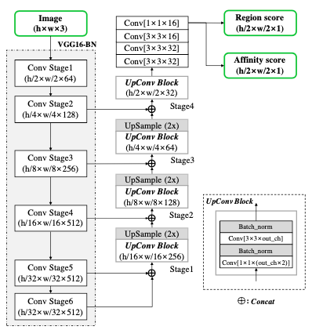
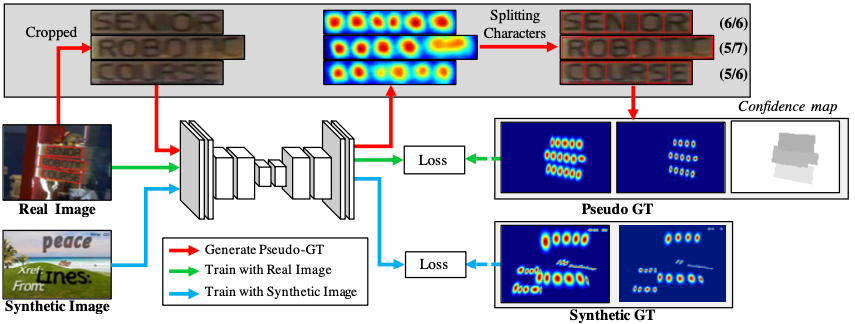
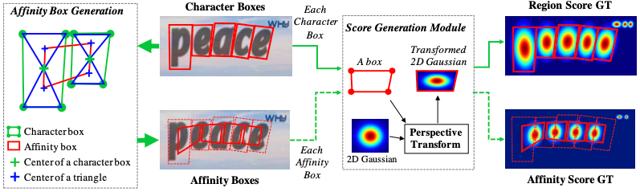
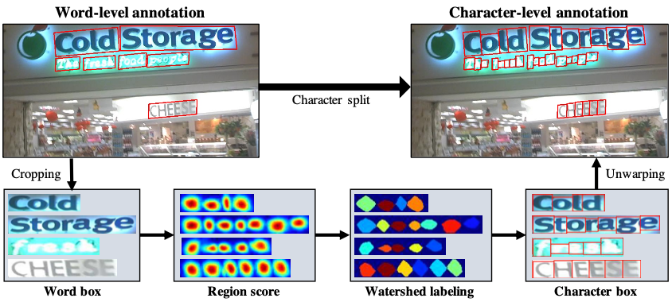
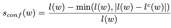
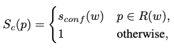
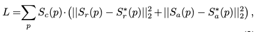
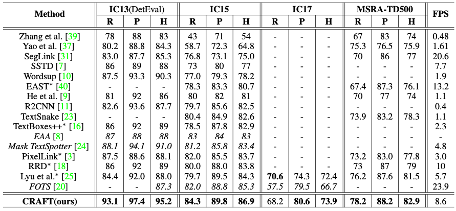

# CRAFT Review

## CRAFT Overview
- CRAFT는 Text Detection 알고리즘으로, 일반적인 Text Detection 알고리즘은 단어 단위의 BBox를 학습하여 검출하지만 Craft 알고리즘은 'Character' 간의 유사성을 통해 Text를 검출한다.

- CRAFT의 목적은 일반 이미지에서 개별 문자를 정확하게 검출하는 것으로, 문자 영역과 문자 간의 관계를 예측하는 DNN을 학습한다.
  - 문자 수준의 annotation을 제공하는 공개 데이터셋이 없기 때문에 weakly-supervised 방식으로 학습 함

- CRAFT는 chracter region score와 affinity score를 출력하는 CNN이댜.
  - chracter region score : 이미지에서 개별 문자를 지역화 하는데 사용
  - character affinity score : 문자들을 단어로 그룹화 하는데 사용

  

## 1) Architecture

 Network 구조

- Backbone 네트워크로는 BatchNorm이 적용된 VGG-16(Fully Convolution Network)을 사용하여 특징을 추출하며 skip-connection을 통해 low-level feature와 병합하여 region score와 affnity score를 예측
  - Region Score : 해당 픽셀이 문자의 중심일 확률 
  - Affinity Score : 해당 픽셀이 문자 사이 공간의 중심일 확률

 

## 2) Training

 전체 학습 과정

  - 1). Syntheic image로 만들어진 GT를 기반으로 모델을 학습 (Intermid model)
  - 2). 이후 real image(word 단위 annotation)로 부터 문자 단위 annotation으로 변경 (Pseudo-Ground Truth)
  - 3). Pseudo-Ground Truth로 최종 모델 학습(Weakly-Supervised Learning)

 

### 2-1) Ground Truth Label Generation

 GT 생성 과정

- Text 이미지에서 문자 단위 바운딩 박스로 region score와 affinit score에 대한 GT를 생성하며 region score와 affinity score를 각각 gaussian heatmap으로 인코딩 함
  - 1). 2D isotropic guassian map 생성 
    - istropic gaussian map : 원형으로 대칭인 가우시안 형태
  - 2). Gaussian map region과 각각의 character box에 대한 perspective transform 계산
  - 3). Gaussian map을 Box영역으로 warping 
- 위 방법으로 GT를 정의하게 되면 receptive fileds가 작아도 크고 긴 텍스트 검출을 가능하게 함 (문자 단위 검출은 convolution filter가 전체 텍스트 대신, 문자와 문자 간의 관계를 학습)

 

### 2-2) Weakly-Supervised Learning
- 대부분의 실제 공개데이터의 경우 단어 단위로 annotation 되어 있기때문에 단어 annotation으로 부터 문자 박스를 생성하여 학습 (Pseudo GT)
  - Pseudo GT는 불완전 할 수 밖에 없기 때문에 신뢰도를 평가하여 사용

- 단어 단위 annotation에서 문자 수위 annotation으로 변경하는 과정은 아래와 같다.
  
  
 Annotation 변경과정

  - 1). 이미지에서 단어 영역을 추출
  - 2). 단어 영역에 대한 region score 예측
  - 3). 문자 영역 분할을 위해 watershed 알고리즘 적용
  - 4). 문자 BBox 생성
  - 5). 문자 박스의 좌표를 원본 영상 좌표로 warping

 

- 단어 길이를 기반으로 pseudo-GT의 Quality를 측정
  - 단어의 길이는 일반적인 word 단위 annotation에서 주어지는 정보 임
  

  

  - Sconf(w) : 샘플에 대한 신뢰도
  - w : 단어 단위 annotation sample
  - l(w) : 단어의 길이, lc : 추정한 단어의 길이
  - R(w) : 단어 바운딩 박스 영역
  - Sc(p) : 이미지에서 pixel p 위치의 신뢰도
  - Sc(p) : real GT의 경우 신뢰도는 1
  - 즉, 실제 단어의 길이와 예측 단어의 길이의 차이에 따라 신뢰도를 판단 (0.5 미만의 신뢰도를 가지는 경우 제외하여 학습)

 

- Loss Function
  
 

  
  - p : 영역 R에 속하는 픽셀
  - S*r(p) : GT resgion score
  - S*a(p) : GT affinity score
  - Sr(p) : 예측한  region score
  - Sa(p) : 예측한 affinity socre
  - 즉, 각 픽셀에 대한 region score의 예측값과 GT의 유클리드 거리 오차와 affinity socre의 예측값과 GT의 유클리드 거리 오차의 총합을 Loss로 정의
  - Intermid model을 학습하는 경우에는 Sc(p) : 1

 

## 3) Inference
- Region Socre와 Affinity Score를 통해 각 문자를 단어로 그룹화 하는 방법
  - 1). 원본 이미지와 동일한 키기의 이진 맵 M 생성 (모든 픽셀을 0으로 초기화)
  - 2). 픽셀 p에 대해 region score(p)혹은 affinity score(p)가 각각 역치값 보다 클 경우 해당 픽셀을 1로 할당
  - 3). 이진 맵M에 대해 Connected component Labeling을 수행
  - 4). 각 Label을 둘러싸는 최소 영역의 회전된 직사각형을 찾음

 

## 4) Result
- 개별 문자 인식 후 문자들을 연결하는 접근 방식은 큰 이미지에서 스케일이 가변적인 텍스트를 검출하는데 있어서 효과적이다.
- 필기체에 대해서는 학습이 쉽지 않다.

  
 
