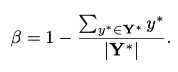

# EAST Review

## EAST Overview
- Text Detection 알고리즘으로 multi-orented text-line 및 word를 검출한다.
- 검출 프로세스를 3단계로 축소하여 'simpl yet powerful' 파이프라인을 제안
  - 기존의 Text detection 알고리즘의 경우 많은 프로세스로 인해 정확도와 효율성이 떨어지는 측면이 있음
- EAST 알고리즘은 FCN 구조를 가지며 이미지의 특징을 추출하기 위한 Feature extractor, 다양한 크기의 Text 검출을 위한 Feature merging branch, prediction 총 3단계로 텍스트를 검출한다. 

  

## 1) Pipeline and Nework Design

 EAST 구조

- 위 그림과 같이 PAVNet(or VGG)를 Backbone으로 사용하여 이미지의 Feature 추출
- 마지막 Convolution 이후(conv stage 4) 추출된 feature map을 unpooling 하여 (두 배씩 키움)  하위 Conv layer의 feautre map과 결합한다. 
  - 즉 서로 다른 Level의 feature mapd을 결합하는 위 두 과정을 통해 다양한 크기의 Text를 검출 할 수 있음 
  - 1x1 convolution layer를 사용한 이유는 파라미터의 수를 줄이기 위한 목적
- Output layer에서는 각 픽셀의 score(Text or Not) + RBOX 위치 + QUADBox 위치 정보를 출력
  - GT Box를 만드는 과정에서 위의 정보들이 포함 됨(아래 Label Generation 참고)
- Output 결과에 NMS 알고리즘을 적용하여 최종 Bounding Box를 검출 

 

## 2) Label Generation

 EAST에서 Text Box의 GT를 생성하는 과정

- (a) : 노란색 점선의 경우 word 크기에 맞는 사각형, 녹색 실선은 margin을 두어 크기를 줄인 사각형
- (b) : Text 영역을 나타내는 text score map
- (c) : 사각형을 둘러싸는 가장 작은 크기의 직사각형
- (d) : text score map에서 각 픽셀의 위치에서 직사각형 4변 까지의 거리
- (e) : 직사각형의 기울어진 각도
- 위 정보를 GT annotation 정보로 만들고 이를 추정한다. (즉, 축소된 사각형 (초록색 실선)내의 영역에 대하여 text score, distance, angle 정보가 저장 됨)
- **RBOX** : BBOX + Angle (자유도 5) ex) (x1,y1,x2,y2,&theta;)
- **QUAD** : 임의 형태 사각형 내의 각 꼭지점 좌표 (자유도 8)

 

## 3) Loss Functions
- L = Ls + &lambda;gLg
    - Ls : score map loss
    - Lg : geometry loss
    - &lambda; = 1

 

### 3-1) Loss for Score Map
- Score map을 추정하기 위한 loss
  

 

### 3-2) Loss for Geometries
- Text box의 위치를 추정하기 위한 RBOX 및 QUAD Loss
- 단순히, 꼭지점 위치에 대한 L1, L2 distance를 적용하게 될 경우 큰 Text 영역의 loss가 작은 Text 영역의 loss에 비하여 커지기 때문에 작은 문자를 잘 인식하지 못할 수 있음

 

- **RBOX LOSS**

 

- **LAABB** : BBox Loss (직사각형, 총 4개의 정보)
  - 박스의 크기에 관계없이 일정한 비율의 loss를 계산하기 위해 IoU를 사용
- **R^** : Prediction box, **R*** : GT box
- &theta;^ : prediction angle, **&theta;*** : GT angle
- **&lambda;&theta;** : 10 (각도에 대한 가중치)

 

- **QUAD LOSS**

 

- 좌표 추정 오차는 smoothed L1 loss로 정의하며, 임의 사각형의 4변 길이 중 가장 짧은 길이로 normalization
  - 이를 통해 사각형의 크기에 따른 loss scale을 유사하게 설정할 수 있음
- **CQ** : 사각형 좌표 값 (총 8개의 좌표)
- **Q^** : prediction QUAD box, **Q*** : GT QUAD box
  - Q : 위 'Label generation' 부분 중 (a)의 초록색 박스에 해당
- **PQ** : GT 'Q'의 4개의 꼭지점 순서를 읨의로 설정한 모든 조합
  - 데이터셋 마다 꼭지점 좌표 annotation 순서가 다르기 때문
- **NQ** : margit을 두고 크기를 줄인 읨의 사각형의 4변 중 가장 짧은 변의 길이
  
 

## 4) Result
- Text Detection을 위한 Process를 간소화하여 빠르고 정확한 text detection 알고리즘을 제안함 
- 비교적 글자 영역 크기에 관계없이 좋은 성능을 보임 
- 세로로 쓰여진 Text의 경우 정확히 검출 할 수 없음

