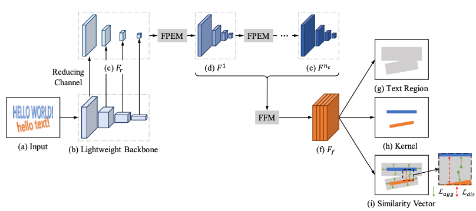
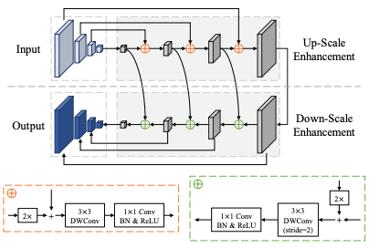
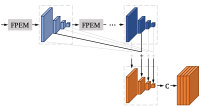
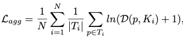
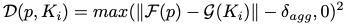
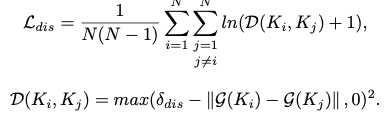
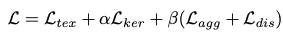
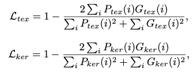

# PAN Review

## PAN Overview
- PAN은 Segmentation-based pipeline으로 arbitrary-shaped text를 검출한다
- Text Detection 알고리즘의 경우 Arbitray-shaped text(Curved Text) detection이 주요 challenge 인데, 기존의 방법들은 복잡한 후처리 과정으로 인해 속도가 느림
- PAN은 단순한 pipeline으로 Arbitray-shaped text 검출의 정확도및 속도를 개선함
- 속도를 향상시키기 위해 가벼운 backbone network(ResNet18)을 사용하였으며, segmentation head를 제안하여 가벼운 backbone network의 단점을 극복
  - FPEM(Feature Pyramid Enhancement Module)
  - FFM(Feature Fusion Module)
- Pixel Aggregation(PA) 후처리 방법을 제안하여 text 영역의 pixel을 병합

  

## 1) Overall Architecture

 PAN Architecture

- PAN의 전체적인 구조는 위 그림과 같으며 Segmentation-based pipeline으로 arbitrary-shaped text를 검출한다
- PAN은 'high effieicnty'(속도를 의미하는 것 같음)를 lightweight backbone을 사용하였으며 단점을 극복하기 위해 Segmentation head 적용
  - lightweight backbone의 단점 : small receptive fields, weak representation capabilities
  - Segmentation head : FPEM, FFM
- Fr : feature pyramid로 1x1 convolution을 통해 feature map의 channel을 축소
- Fnc : FPEMS에 의한 enhanced feature map
- Ff FFM에 의해 결합된 최종 feature map (text 영역을 검출하는 feature map으로 사용 됨)

 

## 2) Feature Pyramnid Enhancement Module

 FPEM 모듈 구조

- FPEM의 구조는 위 그림과 같이 U-shaped 모듈이며 up-scale Enhancement 모듈과 Down-Scale Enhancement 모듈로 구성되어 있음
- 3x3 depthwise convolution을 통해 receptive field를 확장시킬 수 있고, 1x1 convolution을 통해 연산량을 줄일 수 있다. 
- up-scale enhancement 및 down-scale enhancement를 통해 low-level feature와 high-level feature의 정보를 결합하여 다양한 scale에 대응할 수 있다. (FPN과 동일)

 

## 3) Feature Fusion Module

 FFM 모듈 구조

- FFM의 구조는 위 그림과 같으며, FPEM을 통해 추출한 다양한 depth의 feature map을 결합하는 모듈이다.
- 결합방법은 아래와 같다.
  - 1). 동일한 크기의 feature map을 'element-wise addition'을 통해 결합
  - 2). 결합된 각기 다른 scale의 feature map을 up-sampling한 후 병합(Concatenating)

 

## 4) Pixel Aggregation (PA)
- 일반적으로 Text 간 영역은 겹치는 영역이 많은 반면, kernel을 이용하는 경우 text 간 영역을 잘 구별 할 수 있다. (위 Architecture 그림 중 (g),(h) 참고)
- PA는 학습가능한 알고리즘으로 text region의 픽셀들을 kernel에 병합하여 완전한 text 영역을 검출 (clustering 기법 사용)
- PA 방법은 아래와 같다.
  - 1). 검출될 text instance를 cluster, kernels를 cluster의 center로, 각 text 픽셀을 군집화 될 sample로 간주한다.
  - 2). 동일한 text instance의 kernel과 text pixel 사이 차이를 줄이는 것을 목표로 loss 함수를 설계
   

   

   

  - **Lagg** : aggregation loss (동일 text instance 내 text pixel의 차이를 최소화)
  - **N** : text instance의 수, **Ti** : i번째 text instance
  - **p** : text 픽셀, **Ki** : Ti의 kernel
  - **D(p,Ki)** : text instance와 kernel의 거리 차이
  - F(p) : pixel p의 유사도 vector
  - g() : kernel Ki의 유사도 벡터
  - **&sigma;agg** : 상수값 (논문에서는 0.5로 설정)
  - **Ldis** : discrimination loss (text instance간 차이를 유지 즉, cluster의 center 간 사이를 유지하기 위한 loss)

 

## 5) Loss Function

- **Ltex** : text region loss
- **Lker** : kernel loss
- &alpha;, &beta; : 각 loss간의 중요도 balance (논문에서는 각각 0.5, 0.25로 설정)
- **Ptex(i)** : i번째 픽셀의 segmentation 결과
- **Gtex(i)** : i번째 픽셀의 segmentation GT

 

## 6) Result
- PA를 적용하지 않았을 때 약 1%의 정확도(F-measure) 손실이 있었음
- Backbone을 ResNet18보다 큰 ResNet50, VGG16을 사용하였을 때 1%의 정확도 향상이 있었음