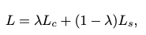
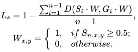

# PSENet Review

## PSENet Overview

- Segmentation 기반의 Text Detection 알고리즘
- 기존 segmentation 기반으 방식들은 서로 붙어있는 Text 영역에 대해 하나로 인식하는 경향이 있는데 kernel-based 방식을 통해 이러한 단점을 해결
  - Progressive Scale Expansion(PSE) 방법을 통해 인접한 Text 영역을 구별
  - kernel의 목적은 텍스트의 인스턴스를 찾고 서로 밀접해있는 텍스트 인스턴스를 분리하는 것

  

## 1) Pipeline & Network Design

 Pipeline

- Backbone Network는 Resnet-FPN을 사용하였으며, 위 그림과 같이 low-level의 texture feature와 high-level semantic feature가 결합되어 feature map F를 생성한다.
  - 다양한 receptive field를 F에 encoding 해준다.
  - Feature conection은 FPN 논문과 동일한 방식으로 수행
    

- feature map F는 n개의 branches로  projection 하여 여러개의 segmentation result S1, S2, ... Sn을 얻는다.
- S1은 가장 작은 Scale로, S1 작은 부분에서 Sn 가장 큰 부분으로 점진적으로 확장시켜 최종 Text Segmentation을 함

 

## 2) Progressive Scale Expansion Algorithm

 Scale Exapnsion 과정

- CNN을 통해 여러 스케일에 해당하는 Segmentation result(S1, S2 ... , Sn)를 획득 한 후 BFS 알고리즘을 기반으로 Scale을 확장하여 Text Segmentation 결과를 얻음
- 위 그림을 기반으로 Scale Expansion Algorithm을 설명하자면,
  - 1). 3개의 Segnemtation Map을 가짐 (S1, S2, S3)
  - 2). S1 (최소 스케일 커널)에서 CC (Connected Components)를 수행하여 각각의 Text 영역을 Segmentation 함
    - 위 그림에서는 (b)가 initial CC 결과임
  - 3). Initial CC결과 (b)와 Segmentation Result S2를 merge하여 확장함, 확장 과정은 (g)와 같으며 반복적으로 근접한 text pixel을 merge 함
    - 확장을 통해 커널과 중복이 생기는 경우 Scale Exapnsion Algorithm을 통해 해결한다.
        

 

## 3) Label Generation

- PSENet의 경우 여러 Scale의 Segmentation result를 만들게 된다. 따라서 학습 과정에서 각 다른 scale의 kernel(GT)를 필요로 하게 된다.
- 위 그림과 같이 단순하게 'Original Text Instance'를 축소함으로써 GT label들이 만들어진다.
  - 위 그림에서 파란색 박스에 해당하는 영역이 Original Text Instance에 해당한다.
- 축소하는 수식은 아래와 같다.
  

  

  - ri : scale ratio
  - Pn, Pi : original polygon과 축소된 polygon
  - di : Pi와의 margin 
  - Area : polyon 영역을 계산하는 함수
  - Perimeter : polygon의 둘레
  - m : minimal scale ratio(0,1]

 

## 4) Loss Function
  

  
  - Lc : complete text instances
  - Ls : 축소된 각각의 feature map에 대한 loss
  - &lambda; = 0.7 (Lc, Ls의 중요도)

 

  

  
  - D(Si, Gi) : Dice coefficient
  - Si,x,y, Gi,x,y : i번째 feature map의 ,x,y 픽셀 위치의 segmentation result와 GT

 

  

  
  - OHEM(M) : 
    - Text와 Non-Text region에 대해 집중하기 위하여 OHEM 적용(Hard example 들을 자동으로 골라서 학습을 효율적이고 효과적으로 하기 위함)
  
 

  
  - Ls : 축소된 텍스트 객체의 Loss  
  - Wx,y : Sn 사이에 비 텍스트 지역의 픽셀을 무시하는 것
  - Sn,x,y ; Sn 안의 픽셀(x,y)의 값