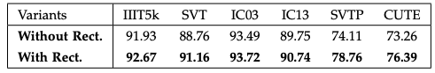

# ASTER Review

## ASTER Overview
- ASTER는 irregular text(curved text)에 대한 인식 성능을 향상시키기 위해 제안된 text recognition 모델로, **rectification network**와 **text recognition network**로 구성됨.
- recitification network는 Thin-Plate Spline의 parameter를 추정하고 이를 통해 불규칙한 text 이미지를 올바르게(regular) 변경한다.
- Text Recognition network는 BiLSTM 모델의 Sequence modeling을 사용하였으며 Attention 구조를 통해 prediction 함
- ASTER Model은 End-to-End로 학습 됨

 

 ASTER Architecture

  

## 1) Rectification Network
- 아래의 그림은 Recitification Network의 구조이며 입력이미지에 대해 TPS(Thine-Plate-Spline) parameter를 예측하며 아래의 그림과 같이 입력이미지에 대해 'Rectified Image'를 얻는다.
  - TPS : 임의의 점에 대한 보간법으로, 주로 이미지 변환에 사용 된다.
- Recitification Network는 Localization Network, Grid Generator, Sampler로 구성되어 있음
- Rectification Network는 [Spatial Transformer Networks](https://arxiv.org/abs/1506.02025)(2015년 deep mind에서 제안)와 동일한 개념이며, 이는 CNN의 한계인 **'spatial variability'** 를 극복하기 위한 방법이다.
  - spatial variability는 크기변화, 회전, 위치이동과 같은 공간적 변화를 의미하며 STN(Spatial Transformer Networks)은 이를 일반적인 형태로 변환한다.

    
 Recification Network Architecture

 

### 1-1) Localization Netwrok
- 입력이미지를 기준으로 k개의 **'Control Points'** 를 예측한다. 
  - Contorl Points : Transformation을 위한 파라미터
- Localization Network는 Convolutional Layer와 Max-pooling layer로 구성되어 있으며 최종 layer는 Fully-Connected Layey로 **2K** 개의 output을 출력한다.
  - Localization Network는 반드시 CNN일 필요는 없다.
  - Controrl Points는 K인데, 2K개의 Output을 생성하는 이유는 입력 이미지의 Control Points 좌표와 Rectified 이미지의 Control Points를 동시에 예측하기 때문

 

### 1-2) Grid Generator
- Grid Generator는 모든 픽셀에 대한 transformation을 계산한다.
- 아래의 그림은 Grid Generator의 예시로, &theta;는 Localization에서 예측한 Points, 이며 Grid Generator는 T&theta;를 계산함

    

 

### 1-3) Sampler
- Rectification Netwokr의 최종 출력으로, rectified 이미지를 생성한다.
- Sampler는 p'(grid generator로 부터 계산된 이미지)로 부터 보간법을 통해 p(rectified image)의 좌표를 예측한다.
  - 즉, p의 픽셀값을 얻기 위해  p'의 어느 위치에서 가져올지를 계산하는 것
  - 보간법을 사용하는 이유는 p' 픽셀의 위치가 정확히 정수값에 대응되지 않기 때문 

 

## 2) Text Recognition Network
- rectified image로 부터 Character를 예측하는 네트워크로 Encoder와 Decoder로 구성되어 있다.
- 양방향의 디코더로(bidirectional docedor) 확장된 sequence to sequence model을 사용하여 text를 인식한다.
  - 양방향 디코더의 경우 'Chcaracter Dependencies'를 확보할 수 있어 성능을 향상시킬 수 있다.
- 아래의 그림은 encoder-decoder 구조로 구성된 Recognition Network 구조

 Recognition Network Architecture

### 2-1) Eencoder
- Recitified 이미지를 입력으로 하여 Convolution layer를 통과시켜 feature map을 추출한다.
- 추출한 feature map을 대상으로 BiLSTM을 적용하여 'long-ranged dependencies'를 획득한다.
  - BiLSTM을 적용하는 이유는, 단순히 CNN을 통해 feature 만 추출하는 경우 'receptive field'에 의한 단점을 보완할 수 있음

 

### 2-2) Decoder
- 앞서 추출한 feature sequence를 character sequence로 변경하며 decoder는 attentional sequence to sequence model을 기반으로 구성되어 있다. 
- attentional sequence to sequence model은 unidirectional recurrent network로, Sequence length(t) 만큼의 반복을 통해 매 단계에서 character 또는 EOS(end of sentence)를 예측한다.
- 아래의 그림과 같이 양방향 디코더 구성을 통해 단 방향 decoder가 'miss'하는 경우를 보완

  

 

## 3) Training
-  ASTER 모델은 End-to-End로 학습되며 아래와 같은 목적함수를 사용한다.
    

   - 양방향 디코더 (좌,우) prediction 결과의 평균을 loss로 함
   - **y1,...,yt** : groundtruth의 character sequence
   - **pltr, prtl** : 각각 left to right, right to left decoder의 prediction loss 를 의미
  
   

-  ADADELTA Optimization 적용 (SGD Optimization을 적용하였을 때도 학습에 성공하였지만 정확도 측면에서 약간 떨어짐)

 

## 4) Results
- Rectifiation Network를 통해 TPS를 적용한 결과 아래와 같이 성능 향상이 있음

 

- 양방향 decoder를 적용한 결과 아래와 같은 성능 향상이 있음

 

- ASTER 모델 Benchmark 결과

