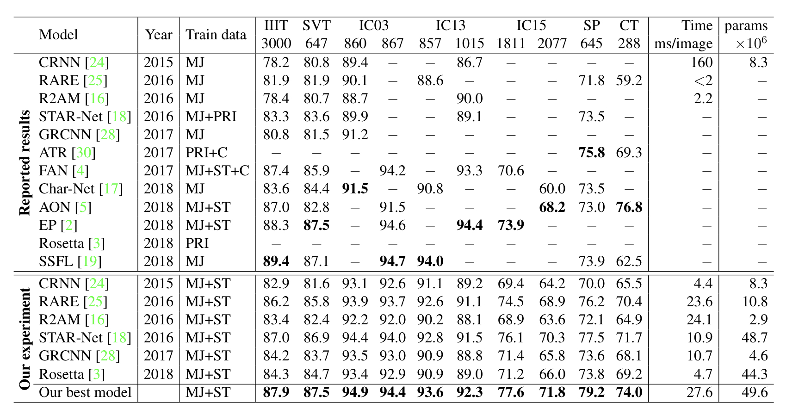
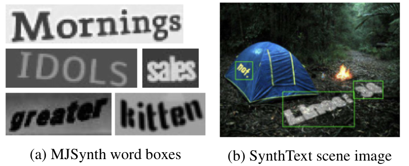
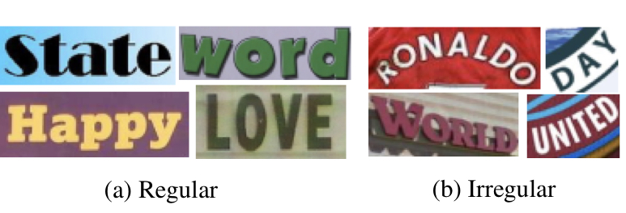
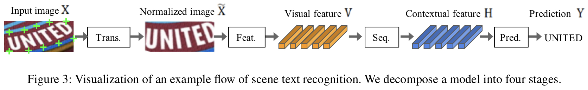
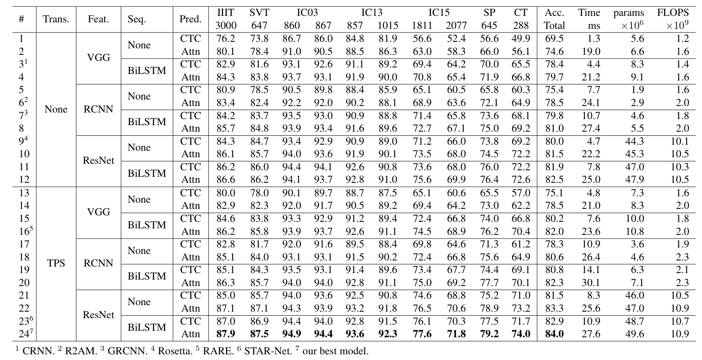
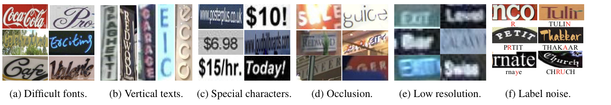

# CLOVA Review

## CLOVA Overview & Introduction

Performance Table

- Training, Evaluation 데이터셋의 불일치로 인한 'performance gap'에 대해 연구
  - 위 표와 같이 train data와 evaluation data의 차이로 인해 모델간 명확한 성능 비교가 어려워 데이터 셋을 일치하여 모델을 재 평가함
- 통일된 Four-Stage STR framework 소개 (이전에 제안된 STR모듈의 광범위한 평가 및 새로운 조합의 모듈을 발견할 수 있다.)
- 모듈 별(module-wise) 성능(accuracy, speed, memory demand)에 대한 기여도 확인

  

## 1) Dataset Matters in STR
  - 제안된 STR 모델들의 정확도의 경우, training dataset이 달라, 제안된 module에 의해 성능이 향상 된 것인지, 더 크고 좋은 training dataset을 사용해서 향상된 것인지 알 수 없음
  - 또한, evaluation 데이터 셋의 경우 sub-set 차이로 인해 비교 불일치가 발생함.
  - 따라서, training dataset과 evaluation 데이터 셋을 아래와 같이 일치시켜 모델들의 성능을 테스트 하였다.

   

| Training Dataset | Info | 
| :---:          | :---:     |  
|MJSynth word boxes:| 8.9M Word box images |
| Synth Text scene Image| 5.5M training data |

 
  
 Synthetic datasets for training

 

| Evaluation Dataset | Eval Imags | Source | Type |  
| :---:          | :---:          | :---:        | :---:         |  
| IIT5K-Words(IIIT) | 3,000 images | Google Image Search | Regular|
| Street View Text(SVT) | 674 iamges | Google Street View | Regular|
| ICDAR2003 (IC03) | 1,110 images | ICDAR 2003 Robust Reading competition | Regular |
| ICDAR2015 (IC15) | 2,007 | ICDAR 2003 Robust Reading competition(Google Glasses) | Irregular |
| SVP Perspective (SP) | 645 images | Google Street View | Irregular|
| CUTE80( CT) | 288 images | natural scenes | Irregular |

 
 
  
 Example of regular and Irregular (Evaluation)

 

## 2) STR Framework Analysis

STR(Scene Text Recognition) Framework

- 위 그림과 같이 STR Framework는 Transforamtion Stage(**Tran**.), Feature Extraction Stage(**Feat.**), Sequence Modeling Stage(**Seq.**), Prediction Stage(**Pred.**) 총 4단계로 구성 됨

- **Transformation Stage**
  - 입력 이미지를 Normalization 하는 단계. TPS(thin-plate spline)가 적용될 수 있음
    - TPS : smooth spline interpolation 적용

- **Feature Extraction Stage**
  - VGG, RCNN, ResNet 총 3가지를 STR의 feature extractor로 사용하여 성능 변화를 측정
    - CNN을 통해 Character Recognition과 관련 없는 특징을 억제 함(font ,color, size, background)

- **Sequence Modeling Stage**
  - 문맥적 정보를 저장하며, Bidirectional LSTM(BiLSTM)은 더 나은 Sequence 정보를 만든다.

- **Prediction Stage**
  - Sequence로 부터 최종 Character를 예측하며, 예측 방법으로는 **Connectionist temporal classification(CTC)**, **attention-based sequence prediction(Attn)** 두 가지의 방법이 있음
    - CTC : 각 Sequence에서 문자를 예측한 후 반복되는 문자와 공백을 삭제하여 Character를 예측
    - Attn : Output Sequence를 예측쳐기 위해 Input Sequence 안에서 정보의 흐름을 자동으로 캡쳐

 

## 3) Experiment and Analyiss
- 각 모듈별 적용 가능한 옵셥에 따라 모든 경우를 테스트 하여 모듈 별 성능 변화를 테스트
  - Trans 모듈 옵션 : None or TPS
  - Feat 모듈 옵션 : VGG, RCNN, ResNet
  - Seq 모듈 옵션 : None or BiLSTM
  - Pred 모듈 옵션 : CTC or Attn
  - 총, 2 x 3 x 2 x 2 = 24가지의 경우에 대하여 테스트

실험결과

### 3-1) Module Analysis
- **Accuracy** 측면에서는 ResNet > BiLSTM > TPS > Attn 순으로 적용하였을 때 가장 효율 적이였음
  - ResNet, BiLSTM, TPS의 경우 속도가 늦어지지만 정확도가 빠르게 높아짐 (13.4%의 정확도 향상)
  - Attn : 속도가 많이 늦어지지만 그에 비해 정확도가 크게 향상되지는 않음 (1.1% 향상)
- **memory**
  - Attn, TPS, BiLSTM의 경우 메모리 사용이 크지 않음
  - ResNet 메모리를 많이 사용 함  
- **ETC**
  - 성능 향상을 위해 training image의 수 보다 training data의 다양성이 더 중요함
- **Modules**
  - ResNet : 배경 혼란 및 처음 보는 font의 경우 개선이 있음 
  - BiLSTM : 잘라진 문자를 무시한다. 
  - Attn : 사라지거나 누락된 문자를 찾음

### 3-2) Failure Case Analysis
- 아래와 같이, Calligraphic Fonts, Vertical Texts, Special Characters, Heavy Occlusion, Low Resolution, Label Noise의 경우 인식률이 낮음

failure case

## 4) Result
- Text Recognition의 경우 
- 각 모듈에서 TPS, ResNet, BiLSTM, Attn을 적용했을 때 가장 좋은 성능을 보임