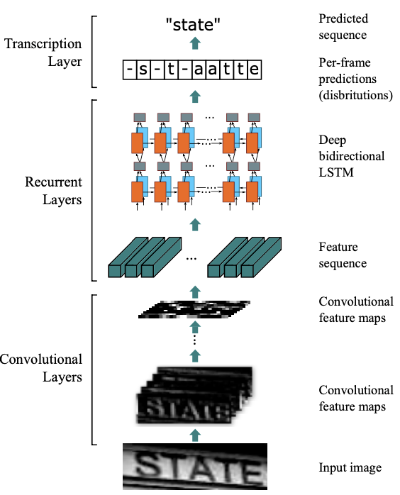
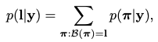
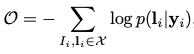
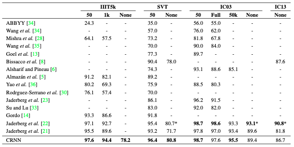

# CRNN Review

## CRNN Overview & Introduction
- CRNN은 CNN과 RNN을 이용한 Sequence Recognition 모델이다. 
- CRNN의 구조는 Convolutional Layers, Recurrent Layers, Trascription Layer로 구성되어 있으며 입력(이미지)로 부터 Text sequence를 인식한다.
-  CTC(Connectionist Temporal Classification) Loss를 사용하여 end-to-end로 모델을 학습한다.
-  
- 

  

## 1) Network Architecture

 CRNN Architecture

- CRNN은 Convolutional Layers, Recurrent Layers, Transcription Layer로 구성되어 있음
- **Convolutional Layers** : 입력 이미지에 대해서 visual feature(sequence feature)를 추출
- **Recurrent Layers** : 각 frame feature(visual feature로 부터 추출한 feature)에 대해 label(character)을 예측
- **Transcription Layer** : 앞서 예측한 label값을 토대로 최종 label sequence(word)를 예측

 

## 2) Feature Seqneuce Extraction
- Max-pooling을 적용한 일반적인 CNN구조를 사용하여 visual feature를 추출하였으며, 이를 통해 feature sequence를 생성
- feature sequence는 추출한 visual feature에서 왼쪽에서 오른쪽 방향으로 동일한 크기(column)로 생성되며 이는 recurrent layer의 입력으로 사용된다.
  
 

## 3) Sequence Labeling
- Recurrent layers는 bidirectional Recurrent Neural Network를 이용하여 앞서 추출한 sequence featuer들에 대한 label(Character)를 예측하게 된다.
- Recurrent layer에 RNN 구조를 사용하는 경우 아래와 같은 장점이 있다. 
  1) Contextual 정보를 잘 추출할 수 있으며, 이미지 기반의 sequence 인식하는 데 있어 전체의 feature를 한 번 사용하는 것 보다 각각 독립적으로 이용하는 것이 더욱 안적정이다.
  2) RNN에서 발생한 'Error'를 CNN으로 back-propagation 할 수있다. (이를 통해 End-to-End 학습이 가능)
  3) RNN을 통해 'arbitrary length'에 대한 인식이 가능하다.
  
 

## 4) Transcription
- Transcription은 frame(sequence feature)에  prediction을 label sequence로 변환하는 과정을 말한다. 
  **ex)-s-t-aatte --> state**

- 변환하는 과정은 Connectionist Temporal Classification(CTC) layer에서 제안된  조건부 확률을 이용한다. 
  - CTC는 학습데이터의 label만 정의되어 있으며 각 클래스의 위치는 모르는 unsegmentted sequence 데이터의 학습을 위해 사용하는 알고리즘. 
  - ex) '-s-t-aatte' : unsegmented sequence   'state' : label

- 조건부 확률에 대한 수식은 아래와 같다.
  

- y : input sequence {y1 ...yt}
- l : label sequence
- &beta; : seq2seq mapping function
  
 

## 5) Training
-  아래는 Objective function 수식으로, GT의 조건부 확률에 대한 'negative log-likelihod'이다. 최적화 함수로는 ADADELTA가 사용되었다.

   - X : training dataset = {이미지, label} 
   - I : 학습 이미지  
   - y : conv layer와 recurrent layer에서 추출한 sequence

 
  
  

## 6) Result
- 아래의 그림은 IIIT5k, SVT, IC03, IC13 데이터셋으로 평가한 CRNN 모델의 정확도 이다.

  

- IIIT5k : 3000 cropped word images from the internet
- SVT : 674 word images from google stret view
- IC13 : 1015 word images  