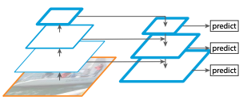
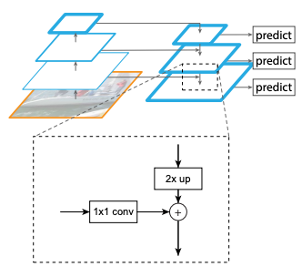
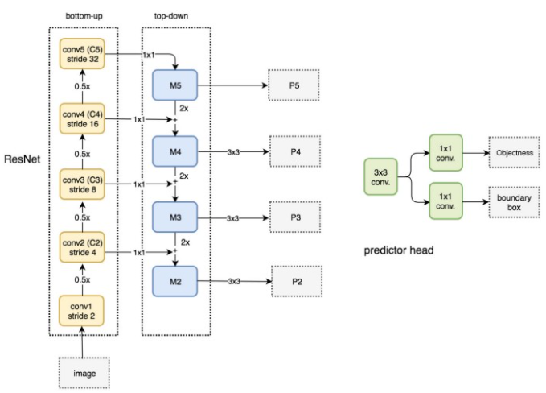

# FPN Review

## FPN Overview
- 이미지 내 객체의 Scale 변화에 강인한 검출기를 구현하기 위해 Feature Pyramid Network(FPN)을 제안
  - 작은 객체를 탐지하기 위한 이전 연구로는, pyramid of images, pyramid of filters, pyramid of anchor 들이 있음
- FPN은 Conv Layer를 거치면서 생성된 각 단계의 feature map을 결합하여 Object Detection을 수행
  - 이를 통해 작은 객체들의 feature가 손실 되는 것을 방지 하며 scale에 강인한 객체 검출이 가능함

  

## 1) Feature Pyramid Network

 FPN Network Architecture

- FPN의 동작과정은 아래와 같다.
  - 입력 이미지에 대해서 각 Convolution layer를 거치며 Feature map을 추출한다. feature map은 layer를 통과하면서 해상도가 1/2로 감소한다(**Bottom-up Pathway**, CNN으로부터 특징을 추출하는 과정)
  
  - 추출된 feature map은 up-sampling을 통해 해상도를 2배 키운 후 1x1 Convolution 연산을 수행한 후 상위 feature mpa과 결합한다 **(Top-down pathway and lateral connections)**
    - up-sampling은 'nearest neighbor up-sampling'을 통해 해상도를 키움
    -   1x1 convolution은 channel의 차원을 축소하기 위한 목적으로 적용
    - 'element wise addition'을 통해 feature map을 결합 **(concatenate 가 아님)**

  
 Top-down pathway and lateral connections

 

## 2) FPN for RPN

 FRN을 통한 RPN 동작 과정

- ResNet을 통해 입력 이미지에 대하여 feature map을 추출한 후 상위 layer 부터 내려오면서 feature map을 결합
  - 위 그림에서는 M5,M4,M3,M2에 해당하며 이는 위에서 설명한 Top-down pathway 방식과 동일 (M : Merged)
- 합쳐진 feature map(M5, M4, M3, M2)에 대하여 3x3 convolution을 적용하여 최종 **'pyramid'** feature map(P5, P4, P3, P2) 생성 
  - 3×3 convolution filter를 적용하여 up-sampling 된 feature map의 'aliasing effect' 효과를 줄일 수 있었음
- 최종적으로 추출한 feature map에 서로 다른 Anchor size를 적용하여 predictor head를 통해 BBox를 예측
  - 하위 feature map(P2)에서 상위 feature map으로 갈 수록 anchor size를 증가시켜 적용 (논문에서는 32x3x, 64x64 ... 512x 512의 ahchor size를 적용)
  - 하위 featuer map의 경우 local 정보에 대한 손실이 적어 작은 객체들의 정보가 포함되어 있을 것이라 가정한 것이며, 반대로 상위 feature map의 경우 큰 객체의 정보가 담겨있을 것이므로 각 feature map에 따라 서로 다른 Anchor size를 적용함
  - 기존의 Faster RCNN의 경우 하나의 feature map에 서로다른 크기의 Anchor size(9개)를 적용하여 BBox를 예측
