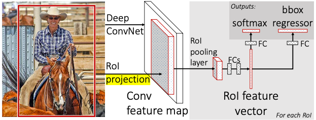
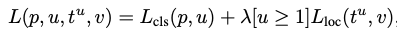

# Fast R-CNN 리뷰

## **Fast R-CNN Overview**

  1) CNN에 입력 이미지를 통과 시켜 feature map 생성
  2) 입력 이미지에 대해 Selective Search통해 후보 region을 생성한 후(region proposal) feature map에 projection
  3) projection된 region(RoI)에 RoI pooling layer를 거처 '고정된' 크기의 feature vector를 추출
  4) 추촐된 feature vector를 통해 각각 fc layer + softmax를 통해 검출된 물체를 분류, fc layer + bbox regression을 통해 검출된 region의 위치를 조정

  

## 1) RoI Pooliong layer
- RoI Pooling Layer는 **fixed-length feature vector**를 추출 하기 위한 방법이며 **fixed-length**는 fully-connected layer의 입력으로 사용하기 위해 필수적이다
- CNN을 통해 추출한 Feature map에 대해 미리 정해놓은 Height(H) X Width(W) 크기에 맞게 그리드 생성 (논문에서는 H=W=7을 사용)
- 각 그리드에 해당하는 영역들에 대해 max pooling을 수행하여 HxW 크기의 고정된 feature map을 성성 (flat 하여 feature vector 생성)

 

## 2) Multi-task loss
- Fast R-CNN 모델의 학습은 추출한 feature vector로 객체의 classification과 bounding box regression을 적용하여 각각의 Loss를 계산하고 이를 back propagation하여 학습
- Classification Loss와 BBox Regression Loss를 동시에 고려하는 것이 Multi-task Loss이다.
- 

  
  - p : class 분류 확률 (Softmax의 결과 값)
  - u : Target Class (GT)
  - t : 객체 검출 위치 (x,y,w,h)
  - v : Target 위치 (GT)
  - [u>=1] : Backgroud의 경우 Loss를 계산하지 않음
  - BBox Regression(Lloc)의 경우 target과 predicition 각각의 차의 합이 1미만인 경우 L2 distance, 아닌경우 L1 distance를 loss로 사용 (이를 smoothL1 loss function이라 함)
    - Outlier 예측에 대해 L2 distance를 적용하는 경우 gradient가 발산 하는 문제를 방지하기 위함

 

## 3) Fine-tuning for detection
- 앞서 계산한 Mult-task loss를 통해 CNN 구조 까지의 fine tuning을 통해 성능을 향상 시킬 수 있었음
- VOC07 데이터 셋 기준, FC layer만 fine tuning하는 것 보다 conv layer까지 fine-tune 하는 것이 mAP기준 약 5% 이상의 성능 향상이 있었음

 

## 4) Result
- mAP : 68.8% on Pascal VOC 2010 dataset
- 알고리즘의 각 요소를 학습하는 R-CNN, SPPNet과 달리, Fast-RCNN의 경우 end-to-end로 CNN, Classification, BBox Regression을 한 번에 학습 