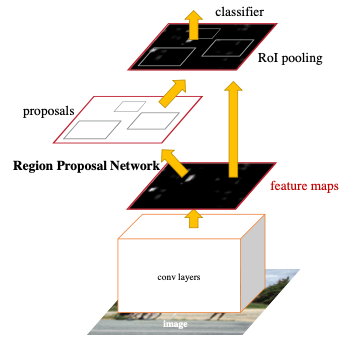
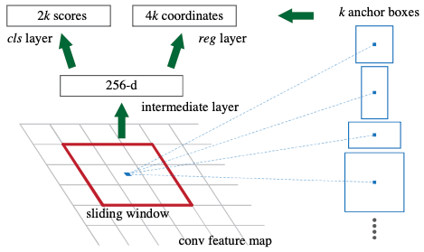
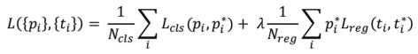

# Faster R-CNN 리뷰

## **Faster R-CNN Overview**

1) 입력 이미지에서 CNN을 통해 Fully Convolutional Feature를 추출
   
2) 추출 된 feature map에서 **Region Proposal Network(RPN)** 를 통해 region을 생성 (위 그림 중 빨간색 사각형에 해당)

3) RPN을 통해 생성된 region들에 RoI Pooling을 수행한 후 Calssification을 통해 객체를 분류하고 BBox Regression을 통해 BBox를 조정한다. (RoI Pooling을 포함한 이후 과정은  Fast R-CNN과 동일)

4) 이처럼 Region Proposal과 객체의 Classification이 순차적으로 수행되는 검출 알고리즘을 **2-Stage Detection** 이라고 한다.
   

  

## 1) Region Proposal Network(RPN)

- CNN을 통해 추출한 feature map에 convolution(3x3)을 수행하여 동일한 크기의 256-d feature map 생성 (intermediate layer)

- 추출 한 feature map에서 각 pixel 마다 pixel을 중앙점으로 하는 k개의 **ahcnor box**를 정의하며 각 anchor 마다 객체의 존재 여부 classification 및 anchor Box 조정을 위한 regression이 수행 
  - Anchor box는 고정 된 다양한 크기의 box를 의미한다. 
  - Anchor box의 수 및 크기는 정의할 수 있으며 논문에서는  {1282, 2562, 5122} x {1:1, 1:2, 2:1}(종횡비) 로 총 9개의 anhor box를 사용함  

- 1x1 convolution 통해 각각 2k개(cls layer), 4k개(reg layer)의 체널을 가지는 feature map 생성 
  - 1x1 convolution을 적용하였기 때문에 feature map의 크기는 이전과 동일하며, 1x1 convolution은 이미지 크기와 관계 없이 동작 할 수있도록 하기 위함  

- cls layer를 통해 얻어진 2k 체널의 feature map이 의미하는 값은 각 anchor box내에 객체가 존재할 확률 값을 의미
  - softmax를 통해 객체 여부 확률값을 계산

- reg layer를 통해 얻어진 4k 채널의 featrue map이 의미하는 값은 anhcor box를 조정하기 위한 예측 값 (Bounding Box Regression과 동일)
  - regression layer는 anchor box와 GT box와의 차이(offset)를 학습한다고 할 수 있다.

- 이렇게 생성된 region들은 앞서 계산한 classification 확률 값에 따라 정렬한 후 일부 앵커만 선택하여 bounding box regression을 적용한다. 최종적으로 Non Maximum Suppression(NMS)를 적용하여 후보 region을 생성하게 된다.
  - 학습시에는 Top-2000개, 테스트 시에는 Top-300개가 적절하다고 함

- 요약하자면, W x H x C의 feature map이 intermediate layer를 거쳐 W x H x 256의 feature map이 생성된 후 cls layer와 reg layer를 거쳐 각각 W x H x 2K, W x H x 4K의 convolution map이 생성된다. 최종적으로 생성된 각각의 convolution map을 해석하여 region proposal을 수행하게 된다.

 

### 1-1) Anchors
- Anchor는 미리 정의된 다양한 크기와 scale을 가지는 Bounding Box로 RPN에서 feature map의 중앙점을 기준으로 총 K개의 anchor box를 생성한다.
- 다양한 크기를 가지는 Anchor Boxes를 통해서 객체의 위치변화 및 scale 변화에 대응 할 수 있다.
  - 일반적으로 객체의 Scale 변화에 대응하는 방법으로는 Pyramids of images, Pyramids of filters가 있다.

 

### 1-2) Loss Function
- RPN에서는 classification task와 BBox regression task 두 가지에서 얻은 loss 값을 고려하여 loss function은 아래와 같이 정의 된다.

  

  - Poitive : IoU >= 0.7, Negative <= 0.3 (Otherwise : 고려되지 않음)
  - Ncls : mini batch(256), Nreg : number of anchors(약 2400개 = 256x9)
  - i : anchor의 index
  - pi : anchor i가 객체일 확률 값, pi* : i 번째 anchor의 GT값(객체 or not)
  - ti : anchor i에 대한 Bbox 좌표, ti* : i 번째 anchor의 BbOX GT값
  - Lcls : classifcation loss (log loss)
  - Lreg : regression loss (smoothL1 loss, Fast R-CNN과 동일)
  - &lambda; : default  값 : 10

 

### 1-3) Training RPNs
- RPN은 back-propagation과 stochastic gradient descent(SGD)를 통해 end-to-end로 학습 된다.
- 한 이미지에서 Random으로 mini-batch(256) 만큼의 anchors를 샘플링 하며, negative anchor와 positive anchor의 비율을 1:1로 한다

  

## 2) Sharing Features for RPN and Fast R-CNN
- 4단계를 거쳐 Faster RCNN 학습 (4-step alternating training)
  - RPNs 학습
  - RPNs을 통해 생성한 region을 이용하여 Fast R-CNN 학습 (Feature를 추출하는 CNN까지 fine-tuning)
  - RPN에 해당하는 layer fine-tuning (RPN과 Fast R-CNN이 동일한 CNN 공유)
  - Fast R-CNN에 해당하는 layer fine-tunning (CNN, RPN은 고정)
  - **이후, Joint training 방식을 도입하여 end-to-end 방식으로 학습이 가능하다는 것을 증명 (정확도도 향상 됨)**

 

## 3) Result
- mAP : 78.8 on VOC 2007 test set 
- region proposal에 신경망을 도입하여 정확도 및 속도 개선