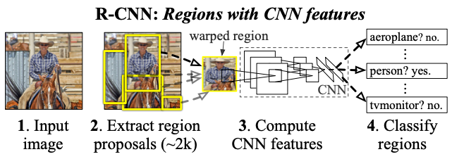

# R-CNN 논문 리뷰

## **R-CNN Overview**

  1) CNN을 이용한 최초의 Object Detection 알고리즘
  2) Selective Search를 이용하여 Region Proposal 수행
  3) Region을 리사이즈(227 x 227)후 CNN을 통과시켜 특징 추출 
  4) 추출된 특징을 SVM 분류기를 통과하여 Object 판별
  5) Bounding Box Regiression을 통해 검출 box의 위치를 조정

  

## 1) Region Proposal
  - Selective Search 알고리즘을 통해 약 2천개의 후보 박스 생성
  - Selective Search는 근접 픽셀들 간의 색상, 질감 등의 정보를 비교하여 영역(Region)을 생성
  - 약 2000개의 후보 Region을 생성 

 

## 2) Feature Extraction
- CNN(AlexNet)을 통해 Region Proposal 단계에서 추출된 region 들의 특징(4096 feature vector)을 추출
- CNN은 ImageNet 데이터로 pre-trained된 모델을 fine-tuning 하여 사용 (클래스의 수는 배경을 배경을 포함하여 N+1개로 fine-tuining)
- Proposal Region들 중 GT의 Bounding Box 영역과 IoU를 비교하여  0.5 이상을 Positive, 0.3 미만을 Negative Set으로 하여 Fine Tuining

 

## 3) Classification & Detection 
- CNN을 통해 추출된 Feature Vector를 각각의 클래스 별로 분류하는 SVM 분류기 학습 (CNN 분류기를 사용하는 것 보다 SVM 분류기를 사용하는 것이 mAP 검증 결과가 더 좋았음, SVM 분류기를 각 클래스 수 만큼 학습)
- 검출된 Bounding Box(BB)가 동일한 물체에 겹쳐져 있는 경우 NMS(Non-Maxim우m Suppression)을 통해 BB를 병합 (논문 기준, IoU가 0.5 이상일 때 동일한 물체를 대상으로 한 박스로 판단)
  
 

## 4) Bounding Box Regression
- Selective Search를 통해 추출한 후보 region의 위치를 최대한 GT와 가깝게 교정하기 위한 목적
- Region이 CNN을 통과할 때 pool5 layer에서 추출된 특징 벡터를 이용하여 region의 위치를 교정
- feature vector는 x, y, w, h로 region의 중앙점(x,y), 너비(w), 높이(h)를 의미 
- P= (Px, Py, Pw, Ph)가 G = (Gx, Gy, Gw, Gh)에 가까워 지도록 하는 함수를 학습 (P는 예측 region, G는 GT region)

 

## 5) Result
- 13s/image on GPU, 53s/image on CPU
- mAP : 53.7% on Pascal VOC 2010 dataset
- CNN, SVM, BB Regressor가 모두 각각 학습 됨
- Selective Search를 통해 검출된 모든 후보 Region을 CNN + SVM 분류기를 통해 판단하므로 처리시간이 오래 걸림
- Region을 종횡비를 무시한 채 resize하기(CNN의 입력으로 사용하기 위해) 때문에 정확도가 떨어짐
- Fine Tuning, Bounding Box Regression을 통해 정확도(mAP) 향상