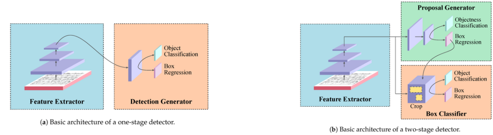
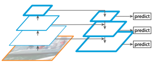
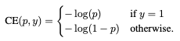
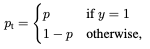
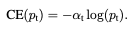
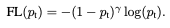
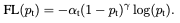
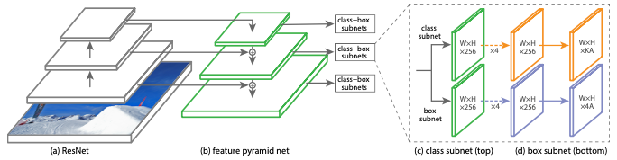
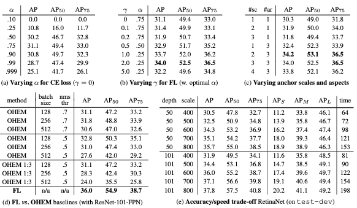
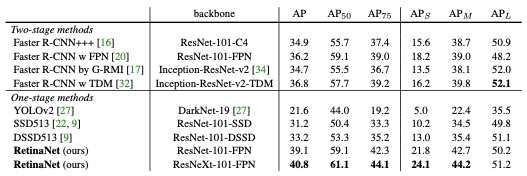

# RetinaNet 논문 Review

## **RetinaNet 간결요약**
- 1-stage detector, 2-stage detector 간의 성능차이를 보이는데, 이는 클래스 불균형으로 인한 것이다.(저자의 주장)
- 따라서, 이를 해결하기 위해 CE(Cross Entropy) loss를 수정한 Focal Loss를 제안
- 즉, RetinaNet은 'One-Stage Detector'로, 새롭게 디자인된 Object Detection 구조가 아니라 Loss 함수를 개선하여 성능을 높인 것

Scaling factor를 통해 easy example이 학습에 미치는 영향을 낮추고 hard example에 대해 더욱 집중한다

  

## **RetinaNet 이해를 위한 사전지식**
- 1-stage detector & 2-stage detector
  - Detector는 Region Proposal(Box를 찾는 것)과 Classification (찾은 Box가 무엇인지 분류) 두 가지로 구성되어 있는데, 이를 나눠서 하면 2-stage, 한 번에 하면 1-stage detector 이다.

 Detector 유형

 

- Anchor
  - Anchor는 미리 정의된 다양한 크기와 scale을 가지는 Bounding Box로 RPN에서 feature map의 중앙점을 기준으로 총 K개의 anchor box를 생성한다.
  - 다양한 크기를 가지는 Anchor Boxes를 통해서 객체의 위치변화 및 scale 변화에 대응 할 수 있다.

 

- FPN (Feature Pyramid Network)
  - Scale 변화에 강인한 특징을 추출하는 방법으로 아래의 그림은 FPN 구조이다.
  

  - 입력 이미지에 대해서 각 Convolution layer를 거치며 Feature map을 추출한다. feature map은 layer를 통과하면서 해상도가 1/2로 감소한다
  - 추출된 feature map은 up-sampling을 통해 해상도를 2배 키운 후 1x1 Convolution 연산을 수행한 후 상위 feature mpa과 결합한다

 

- Class Imblance
  - 본 논문에서 말하는 Class Imblance는 데이터 간 클래스의 불균형을 의미하는 것이 아니라, Region Proposal 단계에서 생성되는 'Box'들이 'Negative'인 경우가 'Positive'인 경우보다 압도적으로 많은 경우를 의미
  - 이게 문제가 되는 이유는 수 많은 easy negative 들이 학습에 많이 사용되므로 비일반적인 모델이 만들어 진다.

  

## **RetinaNet 주요 내용**
 

### 1) Focal Loss의 이해
- Binary Cross Entropy
  

  

  - p : 분류 확률
  - y : gt (1 or 0)
  - 위의 loss는 쉽게 예측되는(easy negative)가 많을 수록 loss가 0에 가까워져 hard example에 대한 loss가 무마 될 수 있다.

 

- Blanced Cross Entropy
  

  - 위 식과 동일한 CE에서 가중치 '&alpha;'를 부여하여 class 빈도수의 역수 만큼을 부여하면 클래스 불균형에 대한 문제를 해결 할 수 있다. (Focal Loss의 기본 개념)

 

- Focal Loss Definication
  

  - 앞선, Blanced Cross Entropy의 '&alpha;'는 'negative', 'postive' 데이터 셋의 정도를 조절할 수 있지만 'easy', 'hard' example을 구분할 수 없다.
  - Focal loss에서는 **'&alpha;'** 를 **(1-pt)&gamma;** 로 변형하여  'easy' example에 대한 중요도를 낮추고 'hard' example 위주로 학습 할 수 있도록 한다.
  - &gamma;=2를 적용했을 때 성능이 가장 좋았음

 

- &alpha;-balanced Focal Loss
  

  - 앞선 Focal-loss에 '&alpha;'를 추가하였을 때 약간의 성능 향상이 있었음

 

### 2) RetinaNet Detector
- 아래의 그림은 RetinaNet Detector의 구조로 Resnet + FPN 구조로 특징을 추출하고 각 feature pyramid를 두 개의 subnet으로 box의 class와 위치를 에측한다. 
  

- Feature Pyramid Network 구조를 Backbone으로 사용함
- Anchor를 이용하여 box 영역을 예측(region proposal)
  - 종횡비 : {1:2, 1:1, 2:1}
  - scale ratio : {20,21/3,22/3}
- Classification Subnet은 각 위치에서 각 Anchor(A)에 대한 Class(K)를 예측한다.
- Box Subnet : A개의 Ahcnor 박스들은 예측과 GT간의 offset 좌표 (centerX, centerY, width, height)를 예측한다. 
- 두 subnet 과는 파라미터를 공유하지 않음

 

### 3) Implementation Details
- Backbone Network : ResNet-101-FPN backbone
- Optimizer : stochastic gradient descent(SGD)
- Batch Size : 16 (GPU당 2개)
- Iteration : 90K
- Learning Rate : [0.01, 0.001, 0.0001]
- Weight decay, momentum : 0.0001, 0.9
- Augmentation : horizontal, image filpping
- 소스코드로 확인해 볼 것
  - anchor box의 기본 크기 
  - subnet의 최종 output 형태

 

### 4) Result
- COCO 데이터 셋으로 통해 검증

 

- Loss 및 anchor 파라미터 변화에 관한 정확됴 변화 실혐 결과 
- OHEM : high-loss example 들로 minibach를 구성해서 성능을 높이는 방법
  

 
 

- 다른 Detector 간 성능 비교 결과
  

