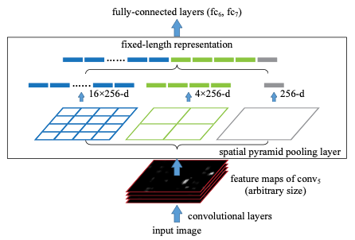

# SPPNet 리뷰

## **SPPNet Overview**

1) 입력 이미지에 대해 CNN을 통과하여 Feature Map을 얻음
2) 입력 이미지에 대해 Selective Search를 적용하여 region proposal 수행
3) Region proposal로 얻어진 region에 해당하는 영역을 **feature map** 에서 추출하여 spatial paramid pooling을 적용하여 feature vector 추출. 이후 해당 vector를 FC layer에 통과
4) 추출한 vector를 각각 SVM 분류기를 적용하여 검출된 객체의 클래스를 분류하고 BBox Regression을 적용하여 객체의 위치를 조정

  

## 1) Spatial Pyramid Pooling (SPP)
- Spatial Pyramid pooling은 'fixed-length vector'를 얻기 위한 방법이다.
- feature map에서 각각의 Pyramid 값으로 feature map을 분할한다. 위 예시 그림에서는 4x4, 2x2, 1x1로 총 3개의 pyramid 값을 적용한 예시
  - 논문의 경우 4개의 pyramid 값을 사용하였으며 크기를 변경하여 실험을 진행하였다.
- 분할 된 각각의 영역(이를 bin 이라고 함)에 해당하는 픽셀값들에 대해 max pooling을 수행
- 각각의 Pyramid 값으로 부터 얻어진 feature map을 각각 flat 하여 연결 함으로써 feature vector 추출

 

## 2) SPPNet for Object Detection
- SPP layer를 통해 얻어진 featrue veector를 이용하여 객체의 클래스를 분류하고 위치를 판단함
- 객체의 클래스를 분류하기 위하여 'binary linear SVM classifier'를 학습하여 객체의 카테고리를 분류 (즉, 분류 카테고리 수 만큼의 Classifier 학습)
- 객체 분류 후 Bounding Box Regression을 통해 검출된 객체의 위치를 조정 (BBox regression의 경우 R-CNN의 방법과 동일하며 SPPNet에서 R-CNN Pool5에 해당하는 layer는 Conv5 layer)

 

## 3) Result
- mAP: 60.9% on VOC 2007 dataset
- CNN, SVM, BBox Regressor가 각각 학습 됨
- R-CNN 대비 Convolution을 한 번만 수행한다는 장점이 있다.