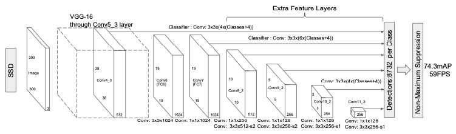
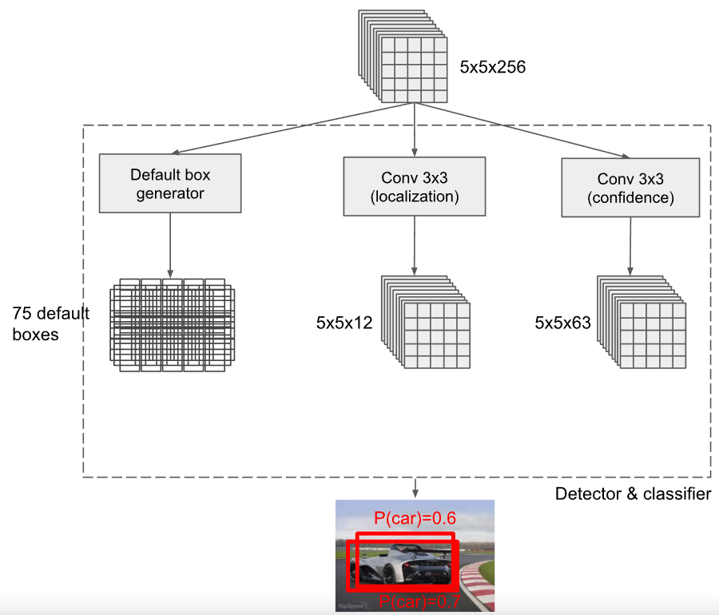
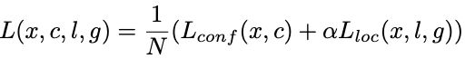
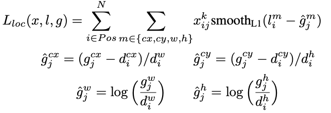
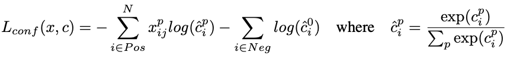

# SSD(Single Shot Detector) 리뷰

## **SSD Overview**

SSD Network Architecture

- SSD Detector의 경우 1-stage detector로 빠르게 객체를 검출 할 수 있으며, YOLO, DeconvNet, Faster R-CNN(Anchor)의 장점을 합쳐 개발됨
- SSD는 convolution을 여러 단계 거치면서 각 단계에서 생성된 feature map마다 Object detection 수행 (위 그림 참고)
- 각 단계에서 얻어진 object를 NMS을 통해 최종 Bbox를 생성
- 이처럼 특징 추출 후, 각 convolution 단계를 거치면서 생성 된 모든 feature map에서 object detection이 일어나기 때문에 다양한 scale의 객체를 검출 할 수 있게 된다. 

  

## 1) Multi-scale feature maps for detection
- 입력 이미지를 300x300으로 resize 한 후 특정 Convolution layer까지 통과하여 feature map 생성
  - 논문의 경우 VGG의 Conv5_3 layer까지 추출
- 다양한 scale의 Object를 고려하기 위해 초기 feature map생성 후 이후 convolution layer에서 추출되는 feature map 마다 object detetion 수행 (FCN의 DeconvNet과 유사)
  - 이를 통해 작은 객체의 feature가 손실 되는 것을 방지할 수 있음
  - 위의 network architecture 그림을 보면 38x38x412, 19x19x1024, 10x10x512, 5x5x256, 3x3x256, 1x1x256의 feature map 마다 detection 수행

 

 추출된 feature map(5x5x256)에서 detection 및 classificaion 하는 방법

  - feature map의 각 cell 마다 3개의 default box를 생성한다
    - 위 그림에서는 5x5크기의 feature map이므로 총 25개의 cell이 존재함 (YOLO에서 grid와 동일한 개념)
    - default box는 Faster R-CNN의 anchor와 유사한 개념으로 미리 정의된 다양한 크기의 BBox를 의미한다. 
  - feature map에서 객체의 위치를 파악하기 위하여 3x3 convolution을 수행하며 각 default box를 기준으로 offset 정보(x,y,w,h) 정보가 output feautre map에 포함된다
    - default box가 각 cell마다 3개씩 생성되므로 최종적으로 얻어지는 output feautre map의 채널은 3x4=12개 이다. (default box의 수 x offset 위치 정보의 수)
  - 각 default box의 클래스 정보를 얻기 위해서 마찬가지로 3x3 convolution 연산이 수행되며 (클래스의 수 + 1(Background)) x default box의 수 만큼의 feature map이 output으로 얻어진다.
    - 논문의 경우 Class의 수는 20이며 따라서 (20+1)x3 = 63 차원의 feature map에 얻어진다.

 

## 2) Training (Loss)
- Loss는 아래와 같이 localization loss(loc)와 confidence loss(conf)의 가중 합으로 계산 됨

  

  - N : objecct와 매칭된 default box의 수 (N=0일 경우 )
  - &alpha; = 1
  - Lconf : confidence loss
  - Lloc :  localization loss
  
  

  
  - i,j : {default box, GT box}
  - cx,cy,w,h : {center x, center y, widht, height}
  - smoothL1 : bounding box regression loss
  - 예측값과 실제 값의 차이를 default box의 너비 또는 높이로 나누어 [0,1]사이의 값으로 정규화

  

  
  
  - c : multiple classes confidence
  - xi,jp = {1,0} (i번째의 default box가 p클래스의 j번째 ground truth box와 매칭) 
  - cross entropy loss function

 

## 3) Result
- 59fps with 74.3% mAP on VOC 2007 dataset
- YOLO 대비 빠른 속도로와 높은 정확도로 객체를 검출함
  - 입력 이미지의 크기가 다르기 때문에 단순 속도 비교는 큰 의미가 없어 보임
  - 하지만, 다양한 Scale을 고려할 수 있도록 하는 Detection 방법이 좋은 Idea라고 생각 함

  

참고 : https://docs.google.com/presentation/d/1rtfeV_VmdGdZD5ObVVpPDPIODSDxKnFSU0bsN_rgZXc/pub?start=false&loop=false&delayms=3000&slide=id.g179f601b72_0_51