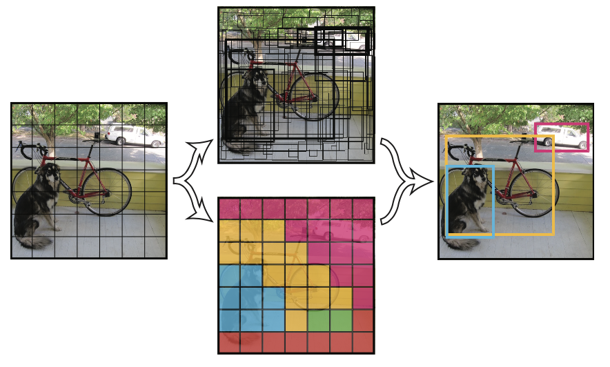
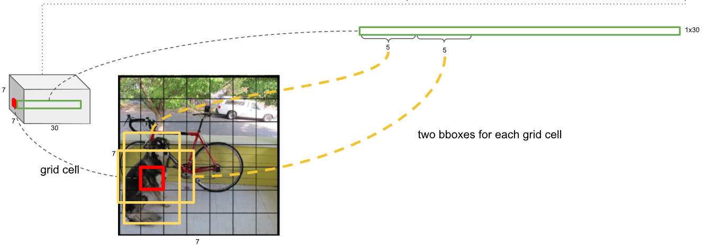
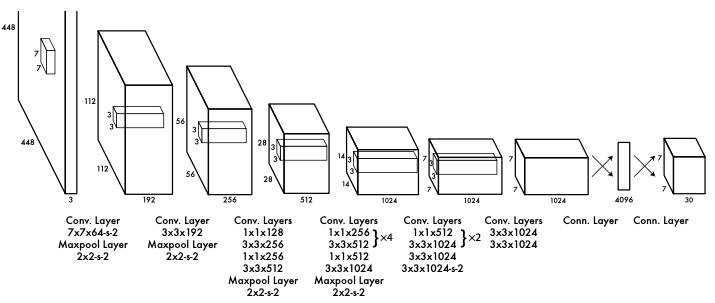
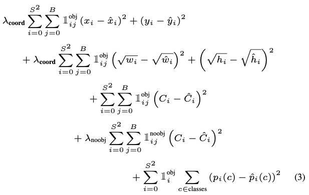

# YOLO v1 Review

## **YOLO v1 Overview**

- 입력 이미지를 448x448로 resize 한 후 CNN을 통과하여 feature map 추출
- 추출한 feature mpa에 SxS 크기의 grid 생성 (위 그림 참고)
- 각 grid 별로 객체의 위치 및 class probability를 예측하여 detection 수행
- YOLO는 classification + detection을 한 번에 수행하는 1 stage-detector로, 빠른 속도로(실시간) 객체를 검출 할 수 있다. (별도의 region proposal이 없음)

  

## 1) Unified Detection (Grid Cell)

- YOLO에서 사용된 Network의 최종 Output은 7x7x30이며, 최종 결과에서 얻어지는 7x7x30챠원의 feature map에 detection 정보가 담겨 있음
- 7x7 grid 별로 두 개의 bounding box를 예측하며 하나의 bounding box는 x,y,w,h,C 5개의 정보를 가짐
  - C : confidence (해당 그리드에 물체가 있을 확률 * gt와의 IoU로 계산 됨)
- 즉, 30차원의 vector 중 첫 10개 vector는 각각 두 개의 bounding box 정보를 의미 함
- 나머지 20차원의 백터는 각 Class일 확률을 의미
  - 논문에서는 20개의 class를 구분하기 떄문에 Bounding box 정보 10챠원 + 20개의 class일 확률로 총 30차원의 vector로 표현 됨 (Class의 수 가 달라지면 차원 역시 달라짐)
- 최종적으로, NMS를 통해 중복된 Boundong Box를 제거한다.
- YOLO는 위 그림처럼, Network의 최종 output에 객체의 BBox 및 Classification 정보가 모두 포함되어 있어 한 번에 객체를 빠르게 검출 할 수 있다.

 

## 2) Network Design & Training

- 위의 그림은 YOLO에서 사용된 CNN 구조이다. GooLeNet의 영감을 받았지만 Inception module을 사용하는 대신 일반적인 convolution으로 network를 구성 (총 24개의 convolutional layer + 2개의 FC layer로 구성)
- CNN은 ImageNet으로 pre-trained된 모델을 사용하였으며, 이후 앞 20개의 convolutional layer는 고정하고 뒤 4개의 layer만 detection에 맞게 학습
  - 224x224 이미지 크기로 pre-trained 한 후 448x448 이미지 크기로 뒤 4개의 layer 학습 
  - detection에 맞게 학습시킨 layer는 initialized wegith로 학슴 됨(이를, "training form strach" 라고 함)

 

## 3) Loss

- Loss 계산 시, NMS를 통해 제거 되지 않은 BBox 결과들에 대해서 만 Loss 계산
- Loss는 Center loss, width, height loss, confidence loss, class probability loss로 구성 됨
- 검출하지 못한 Bbox의 경우 Classification loss만 계산 
- Loss 수식
  - **&lambda;coord** = 5,  **&lambda;noobj** = 0.5 (&lambda;의 목적은 학습의 안정화를 위한 목적으로 Bbox loss는 증가시키고 classification loss는 감소시킴)
  - **S** : grid 크기 (논문에서는 7), **B** : grid별 Bbox 수 (논문에서는 2)
  - Bbox의 예측 w,h에 대해 단순 차이를 계산하는 것이 아니라 루트를 씌워서 계산하는 이유는 큰 상자의 작은 편차가 작은 상자의 편차보다 덜 중요하다는 것을 반영하기 위해서 이다.

 

## 4) Result
- YOLO의 경우 region proposal을 수행하지 않는 1-stage detector로써, 빠르게 객체를 검출할 수 있다는 장점이 있다.
- 하지만, grid를 나누기 때문에 grid 내에 여러 객체가 포함되어 있는 작은 객체의 경우 검출하지 못한다는 한계점이 존재
- Low Recall
- 45 fps, 63.4mAP on VOC 2007 dataset 

  

참고 : https://docs.google.com/presentation/d/1aeRvtKG21KHdD5lg6Hgyhx5rPq_ZOsGjG5rJ1HP7BbA/pub?start=false&loop=false&delayms=3000&slide=id.g137784ab86_4_1907