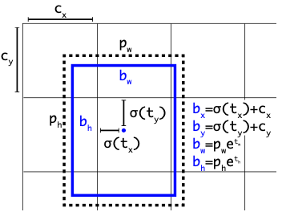
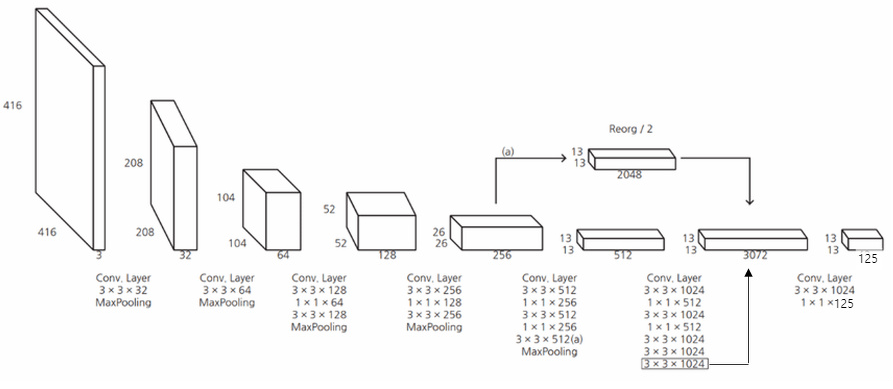

# YOLOv2 Review

## **YOLOv2 Overview**
- YOLOv2는 다양한 실험을 통해 기존의 YOLO의 한계점을 극복하여 더 빠르고 정확한 검출이 가능하도록 함
- Batch Normalization, High Resolution Classifier, Convolutional With Anchor Boxex 등 다양한 기법을 적용하여 정확도를 향상 시킴
- DarkNet(CNN Architecthre)을 Backbone으로 하여 YOLO의 검출 속도 향상
- Hierarchical classification을 통해 9000개의 class를 구분하도록 함

  

## 1) Better
- **Batch Normalization**
  -  기존 YOLO모델에서 모든 Convolutional layer에 batch normalization 적용하여 2% mAP 항상 (dropout layer 제거)
- **High Reoution Classifier**
  - 448x448 크기의 이미지로 pre-trained된 CNN을 사용하여 4% mAP 향상이 있었음(기존 YOLO는 224x224 크기의 이미지로 pre-trained된 모델에 448x448 크기의 이미지로 detection 수행)
- **Convolutional With Anchor Boxes**
  - 기존의 YOLO에서 Fully Connected Layer를 제거하고 Fully Convolutional Network를 사용하며 Anchor box를 도입하여 BBox의 위치를 Ahcnor box의 offset을 학습 및 예측 함 (Faster R-CNN과 동일함)
    - Anchor Box를 적용한 결과, mAP는 69.5%에서 69.2%로 소폭 감소하였지만, recall은 81%에서 88%로 향상 됨
- **Dimension Cluster**
  - Ancor Box의 크기를 사전에 정의된 박스를 사용하는 것이 아니라 학습 BBox 데이터 셋에 k-menas clustering을 적용하여 데이터셋에 많이 들어있는 BBox를 가지고 Anchor의 pre-define size를 측정
    - Faster R-CNN의 경우 'hand-picked'된 9가지 사이즈의 Anchor Box가 사용 됨
  - 논문에서는 5개의 Anchor box를 사용하는것이 recall과 모델의 복잡도를 고려했을 때 가장 적당하다고 함
    - Anchor box의 수가 많이 질 수록 recall이 증가하며 모델의 복잡도 역시 증가하게 된다. 
- **Direct location prediction**
 
  
 YOLOv2 Network 구조 

  - 기존의 YOLO는 예측된 BBox x,y,w,h에 대해서 중심점 예측을 하였지만, YOLOv2에서는 cell의 left top 꼭지점으로부터 얼마나 이동할지를 예측
  - 예측된 Bbox의 w,h의 경우 얼만큼의 비율로 조절할지 지수승을 통해 예측 (수식은 위 그림 참조)
  - 즉, Bbox regression 식을 변경해 준 것이며 이를 통해 예측된 BBox가 cell 영역을 벋어나는 문제를 해결
    - 시그모이드 함수를 적용하여 값의 범위를 0~1로 조절함으로써 예측된 Bbox가 Cell안에 존재하도록 학습 

 

- **Fine-Grained Features**
   
  
 YOLOv2 Network 구조  이미지 출처 : https://89douner.tistory.com/93 

  - 해상도를 높여 작은 객체를 잘 검출 할 수있도록 하기 위한 방법
  - YOLOv2의 기본 모델의 경우 416x416크기의 이미지를 입력으로 받아 13x13x512 크기의 feature map을 생성한다. 하지만, 13x13 크기의 feature map은 크기가 작아 작은 객체의 경우 'semantic' 정보가 손실되어 제대로 검출되지 않을 수 있다.
  - 따라서, 13x13x512 크기 이전의 단계의 feature map인 26x26x256 크기의 feature map을 4분할 하여 13x13x2048의 feature map을 만든다. 이후, 13x13x512의 feature map과 병합하여 최종적으로 13x13x3072의 feature map을 만들어 detection을 수행한다. (위 그림 참고)

 

- **Muli-Scale Training**
  - YOLOv2의 경우 하나의 이미지 크기에 대해서 학습시키는 것이 아니라 다양한 이미지 크기에 대해서 학습하여 Scale 변화에 robust한 모델을 만드려고 함
  - 10 batch 마다 입력 이미지의 크기를 변경하여 학습하였으며 이미지의 크기는 {320,352,....,608}내에서 랜덤으로 선택하여 모델을 학습시켰다.
    - 즉, 입력 이미지에 따라 속도와 정확도에 trade-off 관계가 있음

 

## 2) Faster
 

 darnet19 구조

- 기존의 VGG Network 대신, 경량화된 새로운 **'DarkNet-19'** classification model을 적용하여 속도향상 
- Fully Connected layer를 제거함으로써 파라미터의 수를 줄여 속도를 향상 시킬 수 있었음 
  - YOLO에서 사용된 VGG의 최종 FC layer의 경우 7x7x1024x4096 + 4096x7x7x30 만큼의 파라미터 수가 필요하지만 YOLOv2 Darknet-19의 경우 FC layer 대신 global average pooling을 통해 1000개의 파라미터로 수를 줄일 수 있었음

 

## 3) Stronger
 

 word tree

- Detection 하는 label을 늘릴 수 있는 방법으로, hierarchical classification을 통해 약 9000개의 클래스 라벨을 가지는 detection 모델 학습 (Detection 알고리즘과 적집적인 연관은 없음)
  - ImageNet 데이터의 9000개의 클래스와 COCO 데이터 셋에서 약 300개의 라벨 총 약, 9300개의 class 생성
- 위 그림처럼 class label의 경우 계층 구조를 가진다.
  - ex) physical object > animal > mammal > dog > terrior ..
- 따라서, 분류를 위해 softmax 연산을 수행할 때 전체 클래스에 대해서 수행하는 것이 아니라, 각 대분류 별로 softmax를 수행하여 많은 양의 class를 분류 할 수 있도록 함
- ImageNet Validation 데이터셋으로 YOLO9000을 검증한 결과 19.7 mAP를 얻음

 

## 4) Result
- 이전 버전의 YOLO대비 많은 실험을 통해 mAP 성능 향상이 있었음
